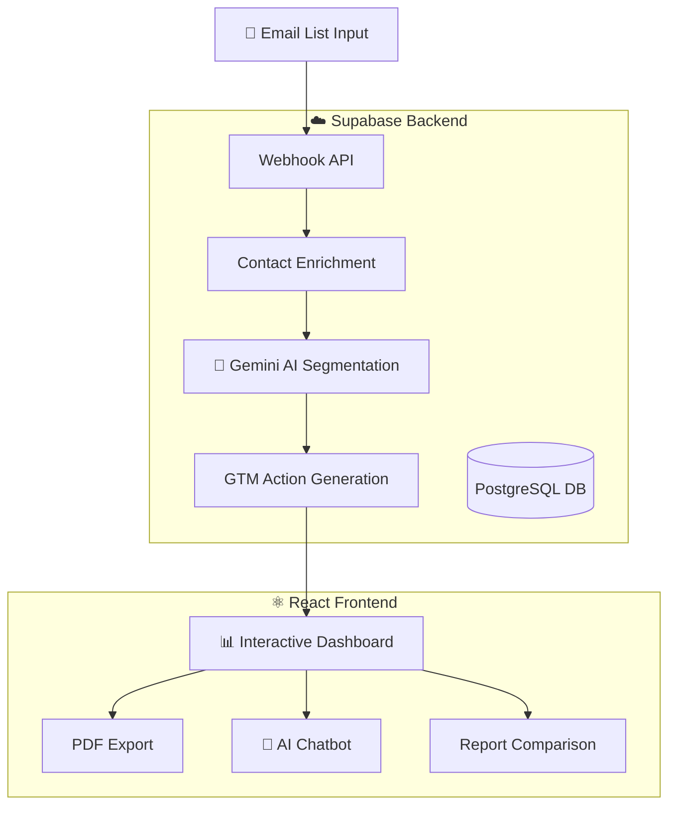

<div align="center">

# 🎯 EngageFlow

### AI-Powered GTM Intelligence Platform

[](https://reactjs.org/)
[](https://www.typescriptlang.org/)
[](https://vitejs.dev/)
[](https://tailwindcss.com/)
[](https://supabase.com/)

[](https://engage-gtm-flow.lovable.app)
[](LICENSE)

<p align="center">
  
</p>

**Transform raw contact data into actionable GTM strategies with AI-powered segmentation and personalized outreach recommendations.**

[Features](#-features) • [Tech Stack](#-tech-stack) • [Getting Started](#-getting-started) • [Architecture](#-architecture) • [API Reference](#-api-reference) • [Team](#-team)

</div>

---

## 🚀 Features

<table>
<tr>
<td width="50%">

### 🔍 Smart Contact Enrichment
Automatically enrich contact data with company information, job titles, funding stages, and tech stack details.

### 🤖 AI-Powered Segmentation
Leverage Gemini AI to intelligently segment contacts based on behavioral patterns, company attributes, and engagement signals.

</td>
<td width="50%">

### 📊 GTM Action Generation
Generate personalized nurture emails, content recommendations, sales routing rules, and product tweaks for each segment.

### 💬 Interactive AI Chatbot
Chat with your analysis data to get instant insights and recommendations using natural language.

</td>
</tr>
</table>

| Feature | Description |
|---------|-------------|
| 📥 **Webhook Integration** | Accept contact data via REST API for seamless automation |
| 📈 **Visual Analytics** | Interactive charts and graphs powered by Recharts |
| 📄 **PDF Export** | Export comprehensive reports with one click |
| 🔄 **Report Comparison** | Compare 2-5 analyses side-by-side to track trends |
| 🌙 **Dark Mode** | Full dark mode support for comfortable viewing |
| 📱 **Responsive Design** | Optimized for desktop, tablet, and mobile |

---

## 🛠 Tech Stack

<div align="center">

### Frontend


### Backend


### AI/ML


### DevOps & Tools


</div>

---

## 📁 Project Structure

```
engageflow/
├── 📂 src/
│   ├── 📂 components/        # Reusable UI components
│   │   ├── 📂 chatbot/       # AI chatbot components
│   │   ├── 📂 landing/       # Landing page sections
│   │   ├── 📂 segments/      # Segment visualization
│   │   └── 📂 ui/            # shadcn/ui components
│   ├── 📂 hooks/             # Custom React hooks
│   ├── 📂 lib/               # Utility functions
│   ├── 📂 pages/             # Route pages
│   ├── 📂 store/             # Zustand state management
│   └── 📂 types/             # TypeScript definitions
├── 📂 supabase/
│   └── 📂 functions/         # Edge Functions
│       ├── analyze-segments/ # AI segmentation logic
│       ├── chat/             # Chatbot API
│       ├── enrich-contacts/  # Data enrichment
│       ├── generate-actions/ # GTM action generation
│       └── webhook-input/    # External data ingestion
└── 📂 public/                # Static assets
```

---

## 🏗 Architecture



---

## 🚀 Getting Started

### Prerequisites

- **Node.js** 18+ or **Bun**
- **npm** or **bun** package manager

### Installation

```bash
# Clone the repository
git clone https://github.com/your-username/engageflow.git
cd engageflow

# Install dependencies
npm install
# or
bun install

# Start the development server
npm run dev
# or
bun dev
```

The app will be available at `http://localhost:8080`

### Environment Variables

Create a `.env` file in the root directory:

```env
VITE_SUPABASE_URL=your_supabase_url
VITE_SUPABASE_PUBLISHABLE_KEY=your_supabase_anon_key
```

---

## 📡 API Reference

### Webhook Endpoint

**POST** `/functions/v1/webhook-input`

Ingest contact data for automatic analysis.

```bash
curl -X POST 'https://your-project.supabase.co/functions/v1/webhook-input' \
  -H 'Content-Type: application/json' \
  -d '{
    "emails": ["john@company.com", "jane@startup.io"],
    "autoAnalyze": true
  }'
```

#### Request Body

| Field | Type | Description |
|-------|------|-------------|
| `emails` | `string[]` | Array of email addresses |
| `email` | `string` | Single email (alternative) |
| `contacts` | `object[]` | Array of contact objects with `email` field |
| `autoAnalyze` | `boolean` | Auto-start analysis (default: `true`) |

#### Response

```json
{
  "success": true,
  "message": "Received 5 email(s) - analysis started automatically",
  "analysis_id": "uuid-here",
  "emails_count": 5,
  "report_url": "/report/uuid-here"
}
```

---

## 📊 Data Flow

1. **Input** → Raw email addresses via UI or webhook
2. **Enrichment** → FullEnrich API adds company & contact data
3. **Segmentation** → Gemini AI clusters contacts into meaningful segments
4. **Actions** → AI generates personalized GTM strategies per segment
5. **Output** → Interactive dashboard, PDF reports, and chatbot insights


## 🧪 Testing

```bash
# Run unit tests
npm run test

# Run tests with coverage
npm run test:coverage
```

---

## 🤝 Contributing

Contributions are welcome! Please feel free to submit a Pull Request.

1. Fork the repository
2. Create your feature branch (`git checkout -b feature/AmazingFeature`)
3. Commit your changes (`git commit -m 'Add some AmazingFeature'`)
4. Push to the branch (`git push origin feature/AmazingFeature`)
5. Open a Pull Request

---

## 👥 Team

<div align="center">
<table>
<tr>
<td align="center">
<strong>Caleb Oladepo</strong><br/>
<sub>Full Stack Developer</sub><br/>
<a href="https://github.com/Caleb-Tech001">

</a>
<a href="https://linkedin.com/in/caleboladepo">

</a>
</td>
</tr>
</table>
</div>

---

## 📄 License

This project is licensed under the MIT License - see the [LICENSE](LICENSE) file for details.

---
